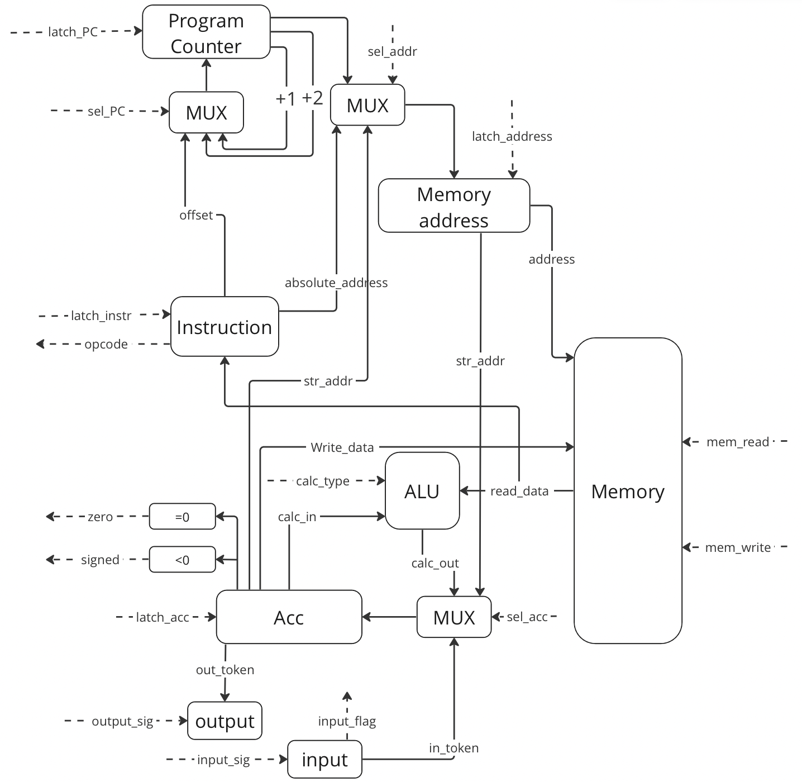
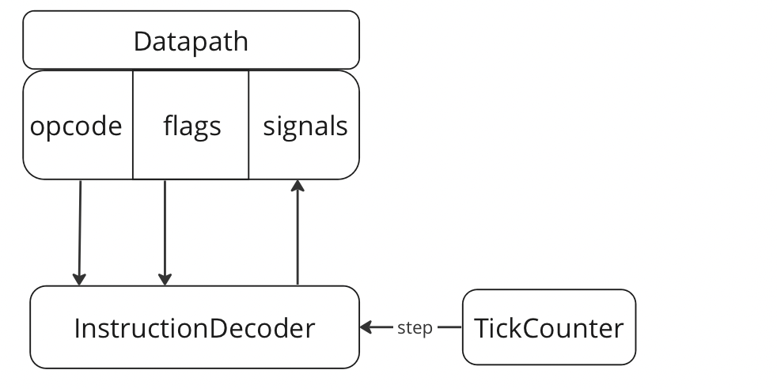
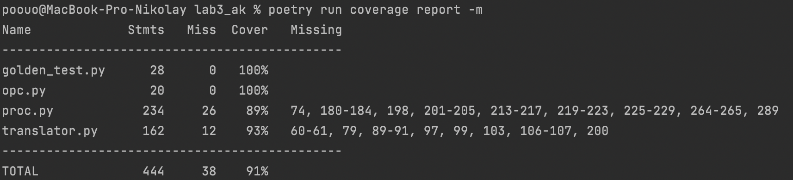

# Задание

- Дорофеев Николай Павлович Р33101
- `alg | acc | neum | hw | tick | struct | stream | port | pstr | prob1 | [4]char`
- Без усложнения

## Язык программирования

Пример:
```
  int x 10;
  str s Hello World!;
  new x = ( x + 1 ) / ( 3 - 2 );
  output_int(x);
  while( x > 0 );
  new x = x - 1;
  output_str(s);
  endWhile;
```
Сложная математика реализована самым банальным способом: транслятор раскладывает выражение на простейшие, результат записывается в первый элемент.
Алгоритм реализуется через память, поэтому проблемы с недостатком регистров не возникает.

### Описание

- ";" -> конец строчки кода
- два типа данных -> int и string
- global scope
- "=" -> вместе с ключевым словом new позволяет изменить значение переменной в памяти
- // - > комментарий, в конце также должна быть ;
- operands ::= "+" | "-" | "*" | "/" | "<" | ">" | "==" | "!=" | "<=" | ">="
- "while", "endWhile" -> цикл с предусловием (фигурных скобок как в Java нет, endWhile означает конец цикла)
- Ввод через встроенные функции input_int(x), input_str(x) -> ввод сразу пишется в переменную
- Вывод также через встроенные функции output_int(x), output_str(x) -> где x - переменная для вывода

### Ограничения 

Все ограничения связаны с упрощением написания транслятора:
- В while и new необходимо ставить проблемы между скобками и значениями
- while не поддерживает математику внутри условия, необходимо сделать ее предыдущей строчкой
- Строки иммутабельны
- Размер int ограничен python: 2**63 - 1
- Размер str ограничен размером памяти, необходимо, чтобы все инструкции и значения записались.
  
  (Если мы имеем код: str s ...;),то макимальная длина будет размер памяти - 1 (первое число это длина строки по варианту)

### Описание по форме Бэкуса-Наура

```
<КОД> ::==  <Идентификатор> <Переменная> | <Пустро> <Арифметическое выражение> | <Сравнение> | <Пусто>
<Идентификатор> ::== <new> | <int> | <string> | <while(> | <endWhile> | <new> | <input_str(> | <input_int(> | <output_str(> | <output_int(> | <\\>
<Типы данных> ::== <int> | <string>
<Операнд> ::== <Число> | <Переменная>
<Операция арифметики> ::== <+> | <-> | <*> | </>
<Операция сравнения> ::== < < > | < > > | <==> | <!=> | < <= > | < >= >
<Арифметическое выражение> ::== <Арифметическое выражение> | <Операнд>  <Операция арифметики> <Арифметическое выражение> | <Число>
<Сравнение> ::== <Операция сравнения> <Операнд>
```

## Память

Машинное слово не определено(инструкции реализованы по варианту словарем, а память общая)
Размер памяти захардкожен и равен 1000. В конце есть зарезервированная ячейка для реализации вывода строк

Числа в памяти выглядят так, записываются начиная с конца

| Значение | Адрес    |
|:---------|:---------|
| 123      | 1000     | 
| 11       | 999      | 
| 0        | 998      | 
| 1        | 997      | 

Инструкции записываются с начала(с 0 адреса, PC также по умолчанию равен 0)

| Opcode | Адрес | Адрес    |
|:-------|:-------|:--------|
| Read   | 999   | 0        | 
| Read   | 998   | 1        | 
| Add    | 997   | 2        | 
| Write  | 998   | 3        |

Opcode и адрес объединяются в отдельный словарь, поэтому для памяти инструкции и числа выглядят одинаково:

({"value": object, "address": int}), где object:
- object = int -> значение числа
- object = {"value": opcode, "address": int} -> инструкция

## Инструкции

|Инструкция   | Кол-во тактов | Описание                                                    |
|:-------------|:--------------|:------------------------------------------------------------|
| add <addr>   | 1             | увеличить значение аккумулятора на число по адресу          |
| sub <addr>   | 1             | уменьшить значение аккумулятора на число по адресу          |
| mul <addr>   | 1             | умножить значение аккумулятора на число по адресу           |
| div <addr>   | 1             | разделить значение аккумулятора на число по адресу          |
| jump <addr>  | 1             | прыгнуть на + addr (в реализации просто PC += addr)         |
| jmpz         | 1             | условный переход acc == 0                                   |
| jmpnz        | 1             | условный переход acc != 0                                   |
| jmps         | 1             | условный переход acc < 0                                    |
| jmpsz        | 1             | условный переход acc <= 0                                   |
| jmpns        | 1             | условный переход acc >= 0                                   |
| jmpnsnz      | 1             | условный переход acc >  0                                   |
| read<addr>   | 1             | прочитать из памяти по адресу addr в акум                   |
| write<addr>  | 1             | записать в память по адресу addr из акума                   |
| readadr<addr>| 2             | записать значение адреса addr в акум                        |
| writeadr     | 2             | записать значение акума в регистр адреса и сразу прочитать из памяти по этому адресу в акум|
| input<flag>  | 1             | получить токен ввода в акум                                 |
| output<flag> | 1             | отправить значение акума как токен вывода                   |
| break        | 0             | остановка                                                   |

- Условный переход при выполненном условии джампит на +2, чтобы пропустить джамп, который идет следующей командой.
- Флаг в инструкциях ввода и вывода необходим из-за различного представления чисел и чаров:
- Если вводим или выводим int, flag = 0
- Если char, flag = 1

Все инструкции представлены в Enum-e [opc.py](opc.py)

## Транслятор

[translator.py](translator.py)

Транслятор делает только один обход токенов(кода разделенного по ";") в основном методе translate

-Ввод: текстовый файл с кодом программы
-Вывод: текстовый файл с машинным кодом(переменные со стартовыми значениями и инструкции)

По первому слову в строчке кода(идентификатору) он добавляет необходимые инструкции

#### while

Так как while не фиксированного размера:
После while транслятор выделяет адрес под инструкцию jump и запоминает его
После endwhile транслятор считает количество инструкций в while, в выделенный адрес пишет инструкцию jump на конец цикла,
Пишет уже в конец инструкций jump на возвращение проверки условия

#### input_str()

Чтобы не усложнять себе задачу(нет необходимости в ином решении) input_str раскрывается транслятором как while который посимвольно читает и сразу же выводит эти символы
Почему я не сделал запись в память прочтенной строки? Из-за необходимости записи в начало строки ее длины. 
PS Это можно реализовать добавив пару новых инструкций и новый регистр.

#### output_str()

Введенные в коде программы строки хранятся в памяти по варианту и выводится также циклом посимвольно при помощи инструкций readadr, writeadr

## Процессор

Реализован в [proc.py](proc.py)

### DataPath

Реализован классом DataPath в proc.py



Регистры:
- memory_address
- acc
- program_counter
- instruction

Флаги:
- zero_flag( =1, если acc = 0)
- signed_flag( =1, если acc < 0)
- input_flag ( =1, если ввод кончился)

### ControlUnit

Реализован классом ControlUnit в proc.py



Сигналы:
- latch_PC
- latch_address
- latch_instruction
- latch_acc
- sel_address
- sel_PC
- sel_acc
- calc_type
- mem_read
- mem_write
- input_sig
- output_sig

Инструкции обрабатываются в два этапа:
1) read_instruction -> 1 такт
2) execute_instruction -> 1 или 2 такта

Счетчик тактов выводит данные всех регистров в журнал работы каждый такт

## Запуск без тестирования

```
python3 translator.py
python3 proc.py
```
Используются файлы в папке [files](files)

## Тестирование

Golden-tests в [golden_test.py](golden_test.py)
Самы тесты находятся в папке [golden_tests](golden_tests)

Запуск тестов
```
poetry run coverage run -m pytest .
poetry run coverage report -m
```
Покрытие тестами кода:


Не покрытыми остались участки кода со сравнениями(использовались не все возможные знаки неравенств), 

а также с умножением и запуском main не через тесты.

Обновление golden-tests

```
poetry run pytest -v --update-goldens
```

Запуск линтера и статического анализатора

```
poetry run ruff check .
poetry run mypy *.py --strict
```

## CI при помощи github actions

Использовал ruff и mypy

name: Python CI

```
on:
  push:
    branches:
      - master
    paths:
      - ".github/workflows/*"
      - "/**"
  pull_request:
    branches:
      - master
    paths:
      - ".github/workflows/*"
      - "/**"

defaults:
  run:
    working-directory: .

jobs:
  test:
    runs-on: ubuntu-latest

    steps:
      - name: Checkout code
        uses: actions/checkout@v4

      - name: Set up Python
        uses: actions/setup-python@v4
        with:
          python-version: 3.11

      - name: Install dependencies
        run: |
          python -m pip install --upgrade pip
          pip install poetry
          poetry install
      - name: Run tests and collect coverage
        run: |
          poetry run coverage run -m pytest .
          poetry run coverage report -m
        env:
          CI: true

  lint:
    runs-on: ubuntu-latest

    steps:
      - name: Checkout code
        uses: actions/checkout@v4

      - name: Set up Python
        uses: actions/setup-python@v4
        with:
          python-version: 3.11

      - name: Install dependencies
        run: |
          python -m pip install --upgrade pip
          pip install poetry
          poetry install
      - name: Check code with Ruff
        run: poetry run ruff check .

      - name: Check code with mypy
        run: poetry run mypy *.py
```

- poetry -> управление зависимостями
- coverage -> измеряет покрытие кода тестами
- pytest -> само тестирование через golden тесты
- ruff и mypy -> утилиты необходимые для задания

## Пример работы в любом из тестов или в папке files

[example](golden_tests/hello.yml)

## Статистика

| ФИО                        |      <алг>      | <LoC> | <code байт> | <code инстр.> | <инстр.> | <такт.> | alg | acc | harv | hw | instr | binary | stream | port | pstr | prob1 | 8bit |
|:---------------------------|:---------------:|:-----:|:-----------:|:-------------:|:--------:|:-------:|:---:|:---:|:----:|:--:|:-----:|:------:|:------:|:----:|:----:|:-----:|:----:|
| Дорофеев Николай Павлович |     hello       |   2   |     -     |      14       |   138    |   301   | alg | acc | neum | hw | tick | struct | stream | port | pstr | prob1 | [4]char |
| Дорофеев Николай Павлович |       cat       |   1   |     -     |      9       |   54    |   109   | alg | acc | neum | hw | tick | struct | stream | port | pstr | prob1 | [4]char |
| Дорофеев Николай Павлович |  hello_user_name|   5   |     -     |      37       |   356    |   767   | alg | acc | neum | hw | tick | struct | stream | port | pstr | prob1 | [4]char |
| Дорофеев Николай Павлович  |      prob1     |   18   |     -     |      37      |   5996    |   11993   | alg | acc | neum | hw | tick | struct | stream | port | pstr | prob1 | [4]char |


